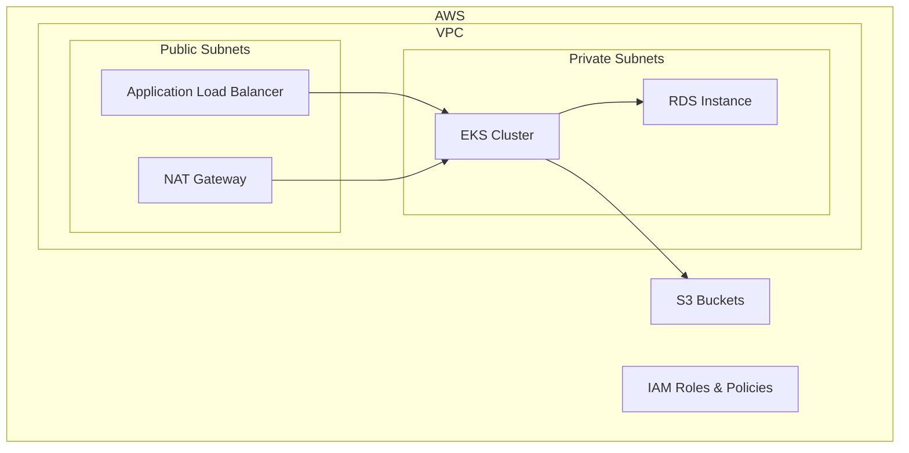

# Infrastructure Overview

## Purpose

This AWS Terraform infrastructure provides a standardized, secure, and scalable foundation for deploying applications in AWS.

## Key Features

### 🔒 Security First
- VPC with public and private subnets
- Security groups with least privilege access
- IAM roles and policies
- Network ACLs for additional security

### 🚀 Scalability
- Auto-scaling groups (when EKS is enabled)
- Load balancers for high availability
- Multi-AZ deployment for RDS

### 🛠️ Maintainability
- Infrastructure as Code (IaC)
- Version controlled configuration
- Modular Terraform modules
- Consistent naming conventions

### 📊 Monitoring
- CloudWatch integration
- Logging and metrics
- Cost optimization features

## Architecture Diagram

## Environment Types

- **Development**: Minimal resources, cost-optimized
- **Staging**: Production-like environment for testing
- **Production**: High availability, maximum performance

## Technology Stack

- **Infrastructure**: Terraform
- **Container Orchestration**: Amazon EKS (optional)
- **Database**: Amazon RDS (optional)
- **Networking**: Amazon VPC
- **Security**: IAM, Security Groups, Network ACLs
- **Monitoring**: CloudWatch

## Team Information

- **Managed by**: ${{ values.team_name }}
- **Environment**: ${{ values.environment_type }}
- **Project**: ${{ values.project_name }}
- **AWS Region**: ${{ values.aws_region }}
